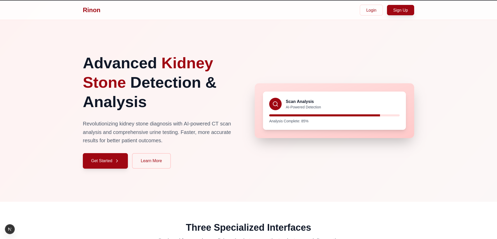
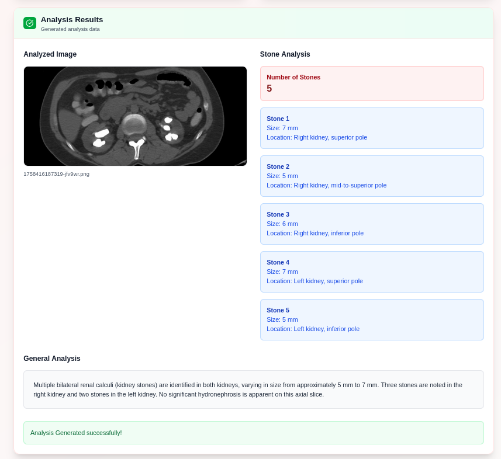
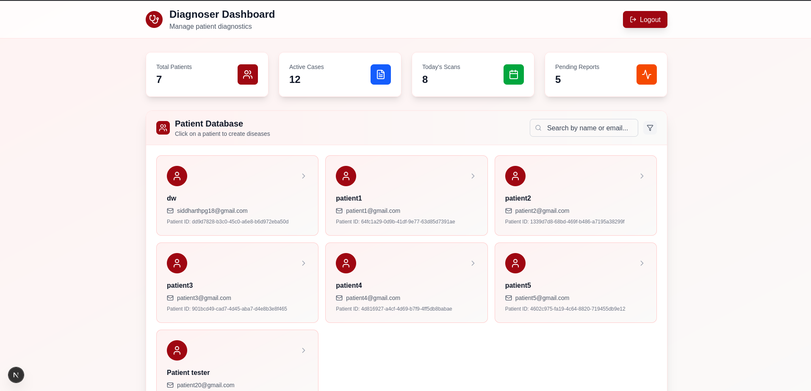
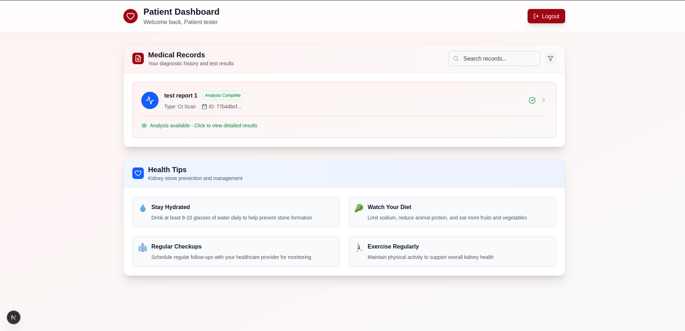
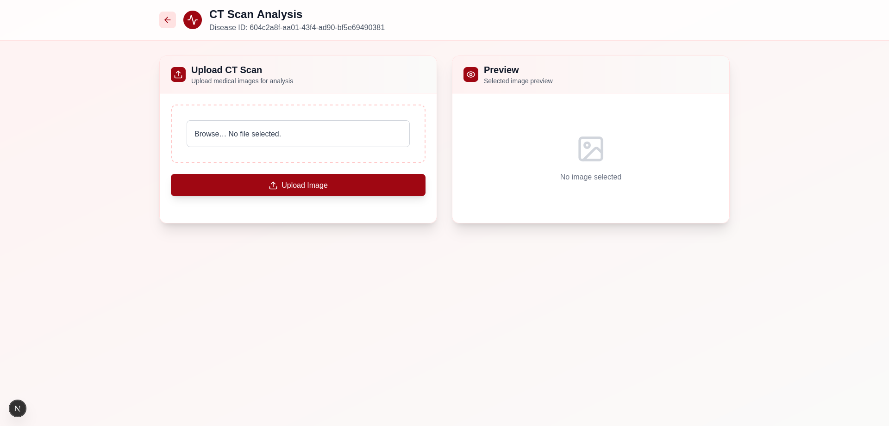

# Project Rinon

Team ID: NH10
Team Name: Galactic Destroyers
Theme: AI in Healthcare

A Project Built by Team **Galactic Destroyers** under the **AI in Healthcare** theme at the **NeuraX 24h Hackathon**

----

## Problem Statement

An AI-based diagnostic system for kidney stone analysis. It analyzes kidney scan images to detect, size, and locate kidney stones. A detailed report is then generated for both doctors and patients. This system aims to address the serious concern of kidney stone diagnosis and treatment by using cutting-edge AI.

## How It Works

Project Rinon operates with a client-server architecture. Users (patients, doctors, or diagnostic centers) can upload patient images. The server uses an ML model to analyze these images and an LLM to create the diagnostic report. All reports are stored in a database for easy access. Both patients and health professionals can benefit from the insights.

----

### Home Page

### Kidney CT Analysis

### Diagnoser Dashboard

### Patient Dashboard

### Uploading of File

----

## Folder Structure

    .
    ├── python/urinalysis/
    │   ├── training/
    │   ├── server.py
    │   └── urinalysis.py
    ├── rinon/
    │   ├── .next/
    │   ├── node_modules/
    │   ├── public/
    │   └── src/app/
    │       ├── auth/
    │       ├── ct/
    │       ├── dashboard/
    │       ├── protected/
    │       └── urinalysis/
    └── server/
        ├── node_modules/
        ├── prisma/
        └── src/
            ├── middleware/
            ├── routes/
            └── utils/

----

### Impact and Value

    - Empowers patients with clear, actionable health information.

    - Boosts diagnostic speed and accuracy, leading to better doctor productivity.

    - Reduces costs and barriers to expert diagnosis, making it useful in low-resource locations.

    - Drives better disease management and continuity of care.

    - Supports data-driven research through anonymized progression analytics.

----

### Future Scope

Project Rinon can expand beyond kidney stones to play a bigger role in the entire healthcare process. Future versions could include:

- Training new ML and LLM models to provide specialized outputs for various medical conditions.

- Building a consultation ecosystem to give more insights to everyone involved, even before the first doctor's visit.